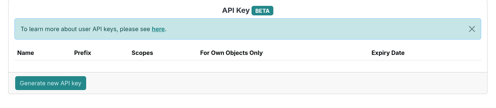
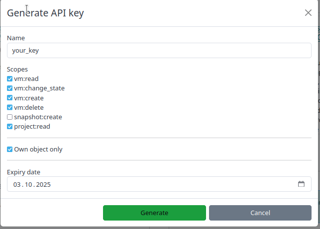
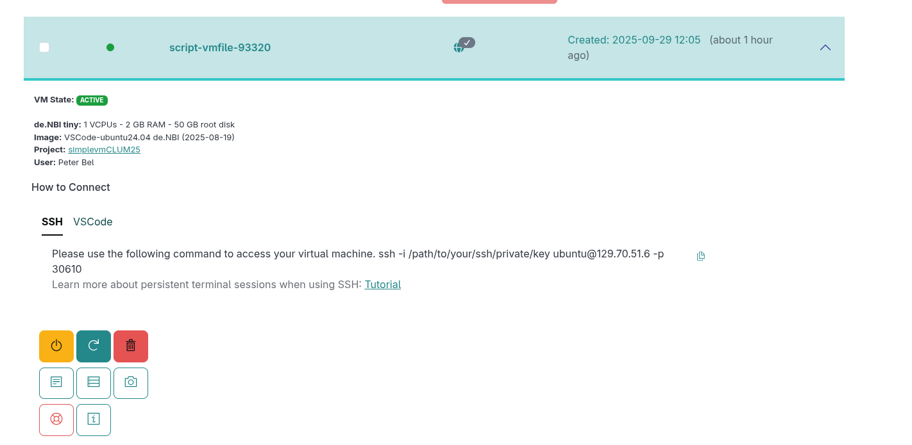

# SimpleVM API Tutorial

This is a basic introduction to the [SimpleVM API](https://simplevm.denbi.de/wiki/simple_vm/user_api_keys/), which is currently a beta feature that is only available upon request.
It demonstrates how to start a VM via the command line and execute a provided script. 

## Prerequisites

### Install jq

The SimpleVM API returns JSON strings that can be formatted using the jq tool.
You can install jq on an Ubuntu server via the following command:
```
sudo apt install -y jq
```

### Generate your API key

You can generate your API via the SimpleVM website



For this tutorial, you will need all the scopes except the 'snapshot:create' scope.




You have to store the key somewhere temporarily on your laptop. You will need it for all subsequent commands.
where it will be referenced as `YOUR_API_KEY`.

## Prepare the execution 

You can list the projects you are a member of by running the following command:

```
curl -X GET https://simplevm.denbi.de/portal/api/projects/ -H "X-API-KEY: YOUR_API_KEY" | jq | less
```
Please look for the **simplevmCLUM25** project and save the **id** of that project. Please store the id somewhere temporarily on your laptop.
In the subsequent commands the id will be references as **PROJECT_ID** 


### Select a flavor

You can list existing flavors with the following command:
```
curl -X GET https://simplevm.denbi.de/portal/api/projects/PROJECT_ID/flavors/ -H "X-API-KEY: YOUR_API_KEY" | jq | less
```

Select a flavor of your choice, and save the name of it. Example: `de.NBI small`
In the subsequent commands the flavor name will be references as **FLAVOR_NAME** 

### Select an image

List existing images:
```
curl -X GET https://simplevm.denbi.de/portal/api/projects/PROJECT_ID/images/ -H "X-API-KEY: YOUR_API_KEY" | jq | less
```

Select an image that contains in the tags attribute either `theiaide`, `vscode` or `guacamole`.
Again, please store the name of the image somewhere temporarily on your laptop.
In the subsequent commands the id will be references as **IMAGE_NAME** 

### Download the script

The following script will be used to download a file from object storage to your VM:
```
wget https://raw.githubusercontent.com/SimpleVM/apiWorkshop/refs/heads/main/data.sh
```

### Run the command 

Now that we have the API key, image, flavor in order to start a virtual machine, we 
tell the SimpleVM API to start the VM and execute a script on start.
The script will download Metagenomics data from S3 once the VM is started. 

Run the actual command where the following parameters must be updated according to your previous API calls:

* API_KEY
* PROJECT_ID 
* IMAGE_NAME
* FLAVOR_NAME 

In addition the **RESENV** variable should be replaced by the corresponding image you had chosen (e.g. vscode, guacamole or theiaide).
Optionally, you can use different name for the VM then `script-vmfile`
```
curl -v -X POST https://simplevm.denbi.de/portal/api/vms/ \
  -d 'project_id=PROJECT_ID' \
  -d 'image_name=IMAGE_NAME' \
  -d 'flavor_name=FLAVOR_NAME' \
  -d 'vm_name=script-vmfile' \
  -d 'research_environment_backend.create_only=true' \
  -d 'research_environment_backend.template=RESENV' \
  -d 'research_environment_backend.user_path=mypath' \
  --data-urlencode "additional_script@data.sh" \
  -H "X-API-KEY: YOUR_API_KEY"
```

Example Call:
```
curl -v -X POST https://simplevm.denbi.de/portal/api/vms/ \
  -d 'project_id=718' \
  -d 'image_nmae=VSCode-ubuntu24.04 de.NBI (2025-08-19)' \
  -d 'flavor_name=de.NBI tiny' \
  -d 'vm_name=script-vmfile' \
  -d 'research_environment_backend.create_only=true' \
  -d 'research_environment_backend.template=vscode' \
  -d 'research_environment_backend.user_path=mypath' \
  --data-urlencode "additional_script@data.sh" \
  -H "X-API-KEY: YOUR_API_KEY"
```

### Verify the correct provisioning

Once you have executed the last API call you can go to the `Instances` page on the SimpleVM website and check whether
SimpleVM has correctly provisioned your VM.



Alternatively, you can check the status of the VM directly via the API. Replace 'YOUR_VM_NAME' with the VM name that you provided at startup.

```
curl -X GET "https://simplevm.denbi.de/portal/api/vms/?text=YOUR_VM_NAME" -H "X-API-KEY: VoHFi7rm.NsoVka9sZsfpxDzvvQIRfsQk7fJhmHXF" | jq | less

```
The VM is ready when the `vm_state` is `active` and the `task_state` is empty.

### Verify that your script was executed

Since we have executed a script on the VM, you can open the research environment in your browser (e.g. vscode, guacamole or theiaide).
And verfiy that the data is at your home directory.

For example, in Guacamole, you can open a terminal and run the following command to check whether the expected files are present:

```
ls ~/
```
The command above should list a file names `DRR127583_1.fastq.gz`.
